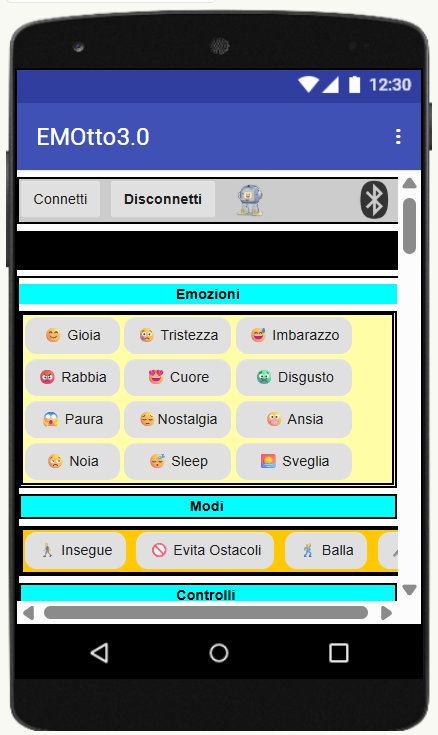
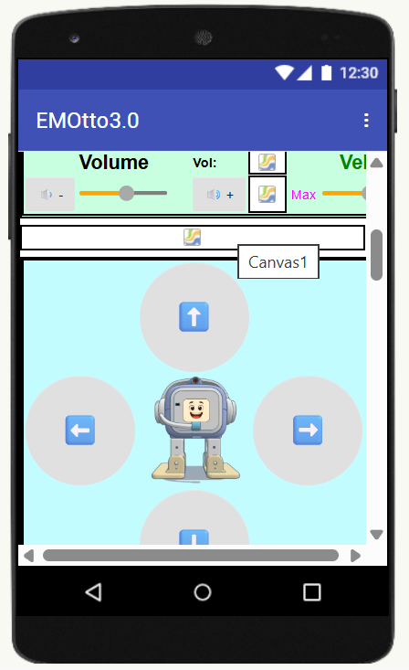

# 🤖 EMOtto 3.0 — ESP32 Emotional Robot Platform

  

  
  
  

**EMOtto 3.0** is an open-source emotional robot platform based on **two ESP32-S3 boards**, designed to combine **animated expressions, motion, sound, and AI vision** into a single interactive companion.

A creative robotics platform for **makers, educators, and developers**.

---

## 🧠 System Architecture

EMOtto uses **two independent ESP32-S3 boards working together**.  
The boards communicate wirelessly and split the workload between **emotion rendering** and **vision intelligence**.

| Board | Role |
|------|------|
| 🖥 **Waveshare ESP32-S3 LCD board** | Face animations, audio playback, servo control, sensors, BLE |
| 📷 **ESP32-S3 N16R8 CAM** | WiFi server, camera streaming, face recognition (Eloquent), UART server for expressions & audio triggers |

---

## 🔗 Quick Links

| Section | Link |
|--------|------|
| LCD Firmware | [Firmware_LCD](Firmware_LCD/) |
| CAM Firmware | [Firmware_CAM](Firmware_CAM/) |
| Face Assets (.bin) | [Assets/facce_bin](Assets/facce_bin/) |
| Audio Files | [Assets/mp3](Assets/mp3/) |
| Hardware & Setup Notes | [Docs/hardware_notes.md](hardware_notes.md) |
| All Images | [Docs/images](Docs/images/) |

---

## 📱 Mobile App Interface

  
  

The Android companion app allows:

- Expression selection  
- Motion control  
- Volume adjustment  
- Camera live stream  

---

## 🧩 Hardware Overview

| Component | Function |
|-----------|----------|
| ESP32-S3 LCD Board | Main controller & display |
| ESP32-S3 CAM | Vision processor |
| PCA9685 | 16-channel servo driver |
| DFPlayer Mini | Audio playback |
| VL53L0X | Distance / interaction sensing |
| WS2812 LED Ring | Emotional “aura” lighting |

---

## 🤖 Real Build Photos

  
   
  
  

---

## ✨ Main Features

- 🎭 Animated facial expressions (eyes + mouth)
- 🔊 Sound & voice via DFPlayer Mini
- 🦿 Multi-servo motion using PCA9685
- 🌈 WS2812 RGB LED aura effects
- 📡 BLE control using NimBLE
- 📷 AI camera vision using EloquentEsp32cam

---

## ⚙️ ESP32-S3 CAM Settings (Arduino IDE)

| Setting | Value |
|--------|------|
| Board | ESP32S3 Dev Module |
| Flash Size | 16MB |
| Partition Scheme | 8M with SPIFFS |
| PSRAM | **OPI PSRAM (REQUIRED)** |

---

## 📜 License

This project is released under **GPL-3.0-only**.

---

## 👨‍💻 Author

**Marco Mortari**  
📧 marco.mortari73@gmail.com  
🔗 https://github.com/MortariMarco  

---

## ❤️ Contributing

Ideas, improvements, and pull requests are welcome.  
EMOtto is an open platform built for the maker community.

